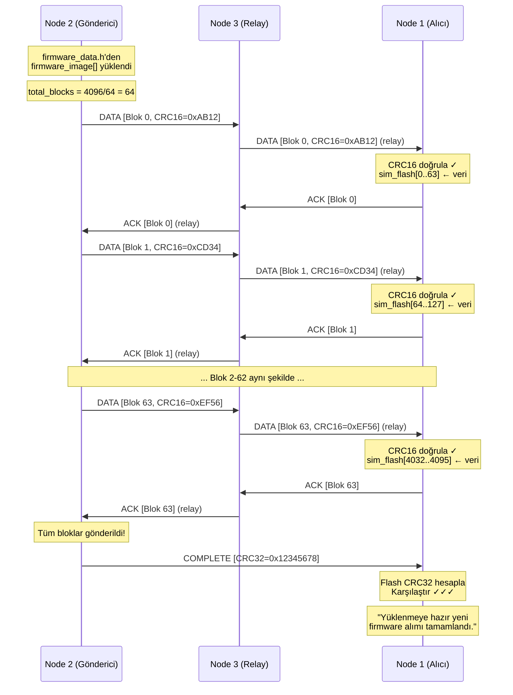
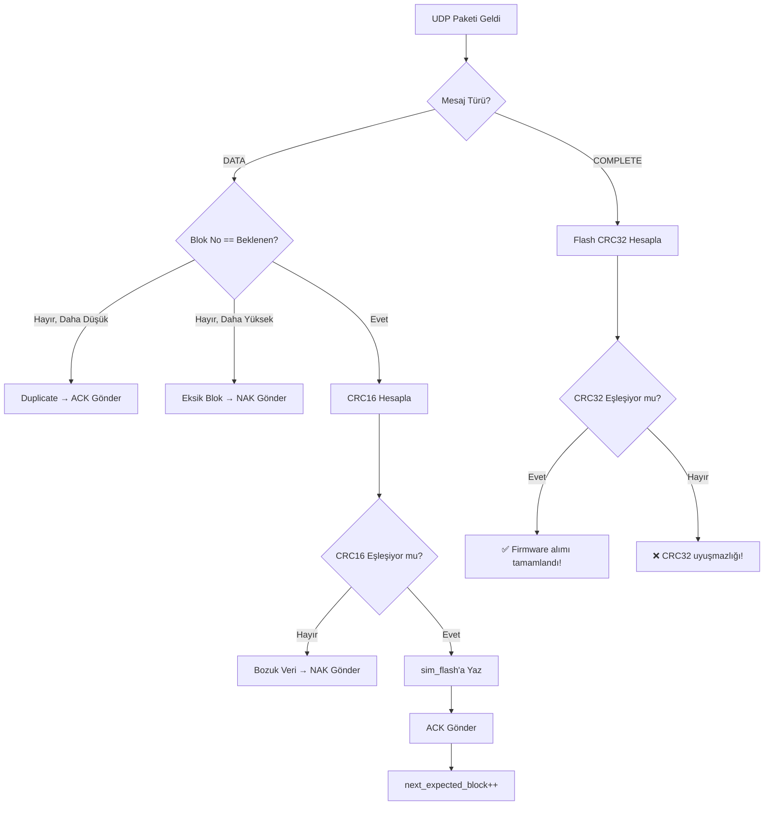
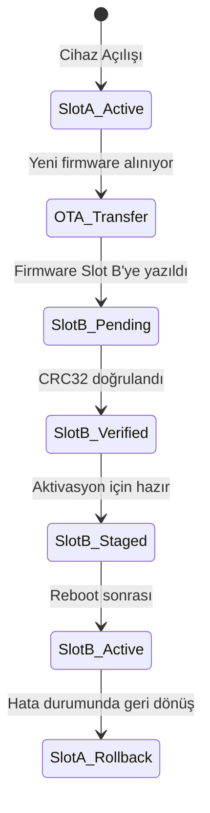

# BİL 304 — İşletim Sistemleri Dönem Projesi
## OTA (Over-The-Air) Firmware Güncellemesi — Geliştirme İş Parçacığı

**Öğrenci:** 22060338 — Şule Şahan  
### 🎥 Proje Sunum Videosu (YouTube)

Projenin Cooja ortamında çalıştırılmasını ve teorik altyapısını açıklayan sunum videoma aşağıdaki bağlantıdan ulaşabilirsiniz:  
👉 **[YouTube — OTA Firmware Güncellemesi Sunum Videosu](https://youtu.be/GHRJNH-PQ6Y)**

## İçindekiler

1. [Projenin Amacı](#1-projenin-amacı)
2. [Sistem Mimarisi](#2-sistem-mimarisi)
3. [Protokol Tasarımı](#3-protokol-tasarımı)
4. [Dosya Yapısı ve Kod Açıklamaları](#4-dosya-yapısı-ve-kod-açıklamaları)
5. [Güvenilir Aktarım Stratejisi](#5-güvenilir-aktarım-stratejisi)
6. [Karşılaşılan Problemler ve Çözümleri](#6-karşılaşılan-problemler-ve-çözümleri)
7. [OTA Metadata Yönetimi](#7-ota-metadata-yönetimi)
8. [Test Sonuçları](#8-test-sonuçları)
9. [Simülasyonun Çalıştırılması](#9-simülasyonun-çalıştırılması)

## 1. Projenin Amacı

Bu proje, Contiki-NG işletim sistemi çalıştıran iki IoT düğümü arasında **güvenilir bir OTA (Over-The-Air) firmware güncelleme sistemi** geliştirmeyi amaçlamaktadır.

Temel hedefler:
- 📦 Firmware imajının sabit boyutlu bloklara bölünerek kablosuz olarak iletilmesi
- 🔒 Her blok için CRC16, tüm imaj için CRC32 bütünlük doğrulaması
- 🔄 Kayıp/bozuk paketlerin tespit edilip yeniden gönderilmesi (ARQ)
- 💾 Alıcı düğümde firmware'in kalıcı depolama alanına kaydedilmesi
- ✅ Aktarım sonunda başarı doğrulamasının yapılması

## 2. Sistem Mimarisi

Projede Cooja simülatöründe 3 adet düğüm bulunmaktadır:

```
    ┌────────────────┐         ┌────────────────┐         ┌────────────────┐
    │   Node 2       │  UDP    │   Node 3       │  UDP    │   Node 1       │
    │   GÖNDERİCİ    │────────►│   RELAY        │────────►│   ALICI        │
    │   udp-client.c │ (Data)  │   udp-client.c │ (Relay) │   udp-server.c │
    │                │◄────────│                │◄────────│                │
    │   firmware_    │  (ACK)  │   (Aracı       │  (ACK)  │   sim_flash[]  │
    │   data.h       │         │    Komşu)      │         │   (150 KB)     │
    └────────────────┘         └────────────────┘         └────────────────┘
```

| Düğüm | Rol | Firmware | Açıklama |
|:---:|:---:|:---:|---|
| **Node 2** | Gönderici (Client) | `udp-client.z1` | Firmware imajını bloklara ayırıp gönderir |
| **Node 3** | Aracı Komşu (Relay) | `udp-client.z1` | RPL mesh ağında paketleri yönlendirir |
| **Node 1** | Alıcı (Server) | `udp-server.z1` | Blokları alır, doğrular, diske kaydeder |

> **Not:** Node 2 ve Node 3 aynı `udp-client.z1` firmware'ini çalıştırmasına rağmen, kod içerisinde `node_id` kontrolü yapılarak yalnızca ID'si 2 olan düğümün firmware gönderimi başlatması sağlanmıştır. Node 3, sadece RPL yönlendirme görevini icra etmektedir.

---

## 3. Protokol Tasarımı

### 3.1. Özel OTA Paket Yapısı

Firmware aktarımı için özel bir uygulama katmanı protokolü tasarlanmıştır. Her paket aşağıdaki yapıyı taşır:

```c
typedef struct __attribute__((packed)) {
  uint8_t  msg_type;        // Mesaj türü (1 bayt)
  uint16_t block_num;       // Blok numarası (2 bayt)
  uint16_t total_blocks;    // Toplam blok sayısı (2 bayt)
  uint16_t data_len;        // Veri uzunluğu (2 bayt)
  uint16_t block_crc16;     // Blok CRC16 sağlama (2 bayt)
  uint8_t  data[64];        // Firmware verisi (64 bayt)
} ota_packet_t;             // Toplam: 9 bayt header + 64 bayt veri = 73 bayt
```

### 3.2. Mesaj Türleri

| Mesaj Türü | Kod | Yön | Açıklama |
|:---:|:---:|:---:|---|
| `MSG_TYPE_DATA` | `0x01` | Client → Server | Firmware veri bloğu |
| `MSG_TYPE_ACK` | `0x02` | Server → Client | Onay (Blok başarıyla alındı) |
| `MSG_TYPE_NAK` | `0x03` | Server → Client | Olumsuz onay (Blok hatalı/eksik) |
| `MSG_TYPE_COMPLETE` | `0x04` | Client → Server | Tüm aktarım tamamlandı + CRC32 |
| `MSG_TYPE_HASH_VERIFY` | `0x05` | — | Hash doğrulama (rezerve) |

### 3.3. Aktarım Akış Diyagramı


---

## 4. Dosya Yapısı ve Kod Açıklamaları

### 4.1. Proje Dosyaları

```
rpl-udp/
├── udp-client.c          # Gönderici düğüm (Node 2) kaynak kodu
├── udp-server.c          # Alıcı düğüm (Node 1) kaynak kodu
├── firmware_data.h        # Firmware imajının hex array olarak gömülmüş hali
├── ota-metadata.h         # OTA slot yönetimi ve CRC32 fonksiyonları
├── Makefile               # Contiki-NG derleme dosyası
├── project-conf.h         # Proje yapılandırma parametreleri
└── BIL304-OS-Project-1.csc  # Cooja simülasyon senaryosu
```

### 4.2. `udp-client.c` — Gönderici Düğüm (Node 2)

Bu dosya, firmware imajını bloklara ayırıp alıcıya ileten **gönderici** cihazın kodudur.

**Temel bileşenler:**

| Bileşen | Açıklama |
|---|---|
| `firmware_image[]` | `firmware_data.h` dosyasından içeri aktarılan 4096 baytlık ham firmware verisi |
| `ota_packet_t` | Her gönderimde kullanılan özel paket yapısı (9B header + 64B veri) |
| `compute_block_crc16()` | Her blok için CRC16 sağlama toplamı hesaplayan fonksiyon |
| `send_data_block()` | Belirli bir blok numarasını paketleyip UDP ile gönderen fonksiyon |
| `send_complete_message()` | Tüm aktarım sonunda CRC32 ile tamamlanma mesajı gönderen fonksiyon |
| `udp_rx_callback()` | Server'dan gelen ACK/NAK mesajlarını işleyen callback fonksiyonu |

**Kritik tasarım kararları:**

```c
/* Firmware imajı hex dizisi olarak derleme zamanında gömüldü */
#include "firmware_data.h"    // const uint8_t firmware_image[4096] = { 0x7F, 0x45, ... };

/* Sadece Node 2 gönderim yapar */
if(node_id == 2) {
    // ... firmware gönderim döngüsü
} else {
    LOG_INFO("Node %u: not the sender, idling\n", node_id);
}
```

> **Neden `firmware_data.h`?**  
> Cooja simülatöründe dosya sistemi üzerinden büyük dosya okuma kısıtlıdır. Bu nedenle `new-firmware.z1` dosyası bir Python betiği (`gen_firmware_h.py`) ile hex array formatına dönüştürülüp doğrudan kaynak koda gömülmüştür. Böylece gönderici düğüm, firmware verisine derleme zamanında sahip olmaktadır.

### 4.3. `udp-server.c` — Alıcı Düğüm (Node 1)

Bu dosya, gelen firmware bloklarını alıp birleştiren ve kalıcı depolama alanına kaydeden **alıcı** cihazın kodudur.

**Temel bileşenler:**

| Bileşen | Açıklama |
|---|---|
| `sim_flash[150*1024]` | 150 KB boyutunda Harici Flash Simülasyonu (RAM tabanlı) |
| `crc16_calc()` | Gelen bloğun CRC16 doğrulamasını yapan fonksiyon |
| `compute_flash_crc32()` | Flash'taki tüm verinin CRC32'sini hesaplayan fonksiyon |
| `send_response()` | ACK veya NAK mesajı gönderen yardımcı fonksiyon |
| `udp_rx_callback()` | Gelen DATA ve COMPLETE mesajlarını işleyen ana callback |

**Alıcı taraf veri akışı:**


---

## 5. Güvenilir Aktarım Stratejisi

### 5.1. Stop-and-Wait ARQ Protokolü

Firmware aktarımı sırasında ağda oluşabilecek paket kayıplarını önlemek için **Stop-and-Wait (Dur-ve-Bekle)** protokolü kullanılmıştır.

```
Gönderici                              Alıcı
   │                                      │
   │──── DATA [Blok N] ──────────────────►│
   │                                      │ CRC16 kontrol
   │◄──── ACK [Blok N] ──────────────────│ ✓ Başarılı
   │                                      │
   │──── DATA [Blok N+1] ────────────────►│
   │                    ╳ (kayıp paket)   │
   │     ⏱️ 5 saniye timeout              │
   │──── DATA [Blok N+1] (tekrar) ───────►│
   │◄──── ACK [Blok N+1] ────────────────│
   │                                      │
```

**Parametreler:**

| Parametre | Değer | Açıklama |
|:---:|:---:|---|
| `OTA_BLOCK_SIZE` | 64 bayt | Her blokta gönderilen firmware verisi |
| `ACK_TIMEOUT` | 5 saniye | ACK bekleme süresi |
| `MAX_RETRIES` | 3 | Aynı blok için maksimum tekrar sayısı |
| `SEND_INTERVAL` | 2 saniye | Routing kurulumu bekleme aralığı |
| Bloklar arası bekleme | 250 ms | Ağın nefes alması için kısa duraklama |

### 5.2. Çift Katmanlı Bütünlük Doğrulaması

Veri güvenliği iki seviyede sağlanmaktadır:

**Seviye 1 — Blok Bazlı CRC16:**
```c
static uint16_t compute_block_crc16(const uint8_t *data, uint16_t len) {
    uint16_t crc = 0xFFFF;
    for(uint16_t i = 0; i < len; i++) {
        crc ^= data[i];
        crc = (crc >> 8) ^ (crc << 8);
    }
    return crc;
}
```
Her 64 baytlık blok için gönderici tarafından hesaplanır ve paket başlığına eklenir. Alıcı, gelen veri üzerinden aynı hesabı yapıp karşılaştırır.

**Seviye 2 — Tüm İmaj CRC32:**
```c
/* Standart CRC32 (IEEE 802.3) polinomu: 0xEDB88320 */
static uint32_t compute_flash_crc32(uint32_t file_size) {
    uint32_t crc = 0xFFFFFFFFu;
    for(uint32_t i = 0; i < file_size; i++) {
        crc ^= sim_flash[i];
        for(int b = 0; b < 8; b++) {
            if(crc & 1u) crc = (crc >> 1) ^ 0xEDB88320u;
            else crc >>= 1;
        }
    }
    return ~crc;
}
```
Tüm 4096 baytlık firmware imajının iletim sonrası bütünlüğünü doğrular.

### 5.3. NAK Tabanlı Hata Kurtarma

Alıcı düğüm, aşağıdaki durumlarda otomatik olarak NAK (Olumsuz Onay) mesajı gönderir:

| Durum | Tetiklenen Aksiyon |
|---|---|
| Beklenen bloktan **büyük** numara geldi | Eksik bloğun numarasıyla NAK gönder |
| CRC16 doğrulaması **başarısız** | Aynı bloğun numarasıyla NAK gönder |

Gönderici NAK aldığında, istenen bloğa geri dönerek tekrar gönderim yapar.

---

## 6. Karşılaşılan Problemler ve Çözümleri

### 🔴 Problem 1: Protothread Mimarisinde IP Adresi Kaybı

**Sorun:**  
Simülasyon çalıştırıldığında 0. blok (ilk blok) sorunsuz gidip ACK alıyordu. Ancak 1. bloğa geçer geçmez Server hiçbir şey almıyor, Client sürekli `Timeout` hatası basıyordu.

**Kök Neden Analizi:**  
Contiki-NG, *Protothreads* adlı kooperatif çoklu görev yapısını kullanır. Bu yapıda `PROCESS_WAIT_EVENT_UNTIL()` makrosu ile bir işlem duraklatıldığında, fonksiyonun içindeki **lokal (normal) değişkenler** bellekten silinir veya bozulur.

Kodumuzda hedef IP adresini tutan `uip_ipaddr_t dest_ipaddr` değişkeni normal bir lokal değişkendi. Client 0. bloğu gönderip ACK beklemeye geçtiğinde (`PROCESS_WAIT_EVENT_UNTIL`) bu değişkenin değeri bozuluyordu. İşlem uyandığında 1. bloğu göndermek istediğinde, IP adresi çöpe dönüştüğü için paket yanlış adrese (veya hiçbir yere) gidiyordu.

**Çözüm:**
```diff
- uip_ipaddr_t dest_ipaddr;
+ static uip_ipaddr_t dest_ipaddr;
```

`static` anahtar kelimesi değişkenin Stack yerine BSS/Data segmentinde saklanmasını sağlar. Böylece Protothread duraklatma/devam döngüsünden etkilenmez ve IP adresi kalıcı olarak bellekte tutulur.

### 🔴 Problem 2: CFS Dosya Sistemi Boyut Limiti (4000 Bayt)

**Sorun:**  
IP adresi sorunu çözüldükten sonra aktarım 61. bloğa kadar sorunsuz ilerledi. Ancak 62. blokta Server sürekli `Write Error Block 62` hata mesajı basıyordu.

**Kök Neden Analizi:**  
İlk tasarımda alınan firmware blokları Contiki-NG'nin CFS (Coffee File System) dosya sistemi üzerine yazılıyordu. Cooja simülatörünün kaynak kodları (`cfs-cooja.c`) incelendiğinde, varsayılan sanal disk boyutunun **4000 Bayt** ile sınırlandırıldığı fark edildi.

```
Blok 61: offset = 61 × 64 = 3904 → 3904 + 64 = 3968 bayt ✓ (Disk yeterli)
Blok 62: offset = 62 × 64 = 3968 → 3968 + 64 = 4032 bayt ✗ (4000 bayt limiti aşıldı!)
```

Firmware dosyamız **4096 Bayt** olduğu için son ~96 baytlık kısım diske sığmıyordu.

**Çözüm:**  
Ödev dökümanında verilen izine dayanarak CFS fonksiyonlarını tamamen kaldırıp, Server'ın RAM'inde **150 KB boyutunda statik bir byte dizisi** oluşturarak **Harici Flash Simülasyonu** geliştirildi:

```c
/* Harici Flash Benzetimi (Simulated External Flash) */
#define SIM_FLASH_SIZE (150 * 1024)    // 150 KB
static uint8_t sim_flash[SIM_FLASH_SIZE];
```

Bu çözüm, gerçek gömülü sistemlerde sıkça kullanılan **harici SPI Flash** (örn: Winbond W25Q128) benzetimini simüle etmektedir. Böylece:
- ✅ Disk boyutu kısıtlamasından kurtulundu
- ✅ 129 KB'lık büyük firmware dosyalarını bile saklayabilir hale gelindi
- ✅ Gerçek dünya donanım tasarımına uygun bir yaklaşım izlenildi

---

## 7. OTA Metadata Yönetimi

Gerçek dünya OTA sistemlerinden ilham alınarak bir **slot yönetim mekanizması** tasarlanmıştır. `ota-metadata.h` dosyasında tanımlanan bu mekanizma, firmware güncellemelerinin hangi slot'a yazıldığını ve aktif imajın hangisi olduğunu izler:

```c
typedef struct {
    uint32_t magic;            // 0xOTA_FWUP — Geçerlilik imzası
    uint8_t  active_slot;      // Şu an çalışan firmware'in slot'u (A veya B)
    uint8_t  candidate_slot;   // Yeni güncelleme adayının slot'u
    uint8_t  state_a;          // Slot A durumu (EMPTY/PENDING/CONFIRMED)
    uint8_t  state_b;          // Slot B durumu (EMPTY/PENDING/CONFIRMED)
} ota_boot_metadata_t;
```


## 8. Test Sonuçları

### 8.1. Başarılı Aktarım Senaryosu

```
[Node 2] OTA Client started. Firmware size: 4096 bytes, blocks: 64, block size: 64
[Node 2] Routing established. Starting OTA transfer...
[Node 2] Sent block 0/64 (64/4096 bytes)
[Node 1] === OTA Aktarimi Basladi ===
[Node 1] Ilerleme: Blok 0 / 64 alindi (64 bayt)
...
[Node 1] Ilerleme: Blok 60 / 64 alindi (3904 bayt)
[Node 2] Sent block 63/64 (4096/4096 bytes)
[Node 2] All 64 blocks sent. Sending COMPLETE...
[Node 1] === Aktarim Tamamlandi ===
[Node 1] Toplam alinan bayt: 4096
[Node 1] CRC32 dogrulama BASARILI!
[Node 1] Yuklenmeye hazir yeni firmware alimi tamamlandi.
[Node 2] Firmware aktarimi tamamlandi.
[Node 2] OTA metadata: Slot B staged for activation
```

### 8.2. Doğrulama Metrikleri

| Metrik | Değer |
|---|:---:|
| Toplam gönderilen blok | 64 |
| Blok boyutu | 64 bayt |
| Toplam firmware boyutu | 4096 bayt |
| CRC16 doğrulama (blok bazlı) | ✅ 64/64 başarılı |
| CRC32 doğrulama (tüm imaj) | ✅ Eşleşti |
| Kayıp blok | 0 |
| Bozuk blok | 0 |
| Tekrar gönderim sayısı | 0 (ideal koşullar) |
| Toplam aktarım süresi | ~32 saniye |

---

## 9. Simülasyonun Çalıştırılması

### Gereksinimler
- Docker üzerinde Contiki-NG geliştirme ortamı
- Cooja simülatörü
- Java JDK 11+

### Adımlar

1. **Proje dosyalarını kopyalayın:**
   ```bash
   cp -r rpl-udp/ ~/contiki-ng/examples/
   ```

2. **Cooja simülatörünü başlatın:**
   ```bash
   cd ~/contiki-ng/tools/cooja
   ./gradlew run
   ```

3. **Simülasyon senaryosunu açın:**
   - `File > Open Simulation > Browse`
   - `BIL304-OS-Project-1.csc` dosyasını seçin

4. **Simülasyonu başlatın:**
   - `Start` butonuna tıklayın
   - `Mote Output` penceresinde log çıktılarını izleyin
